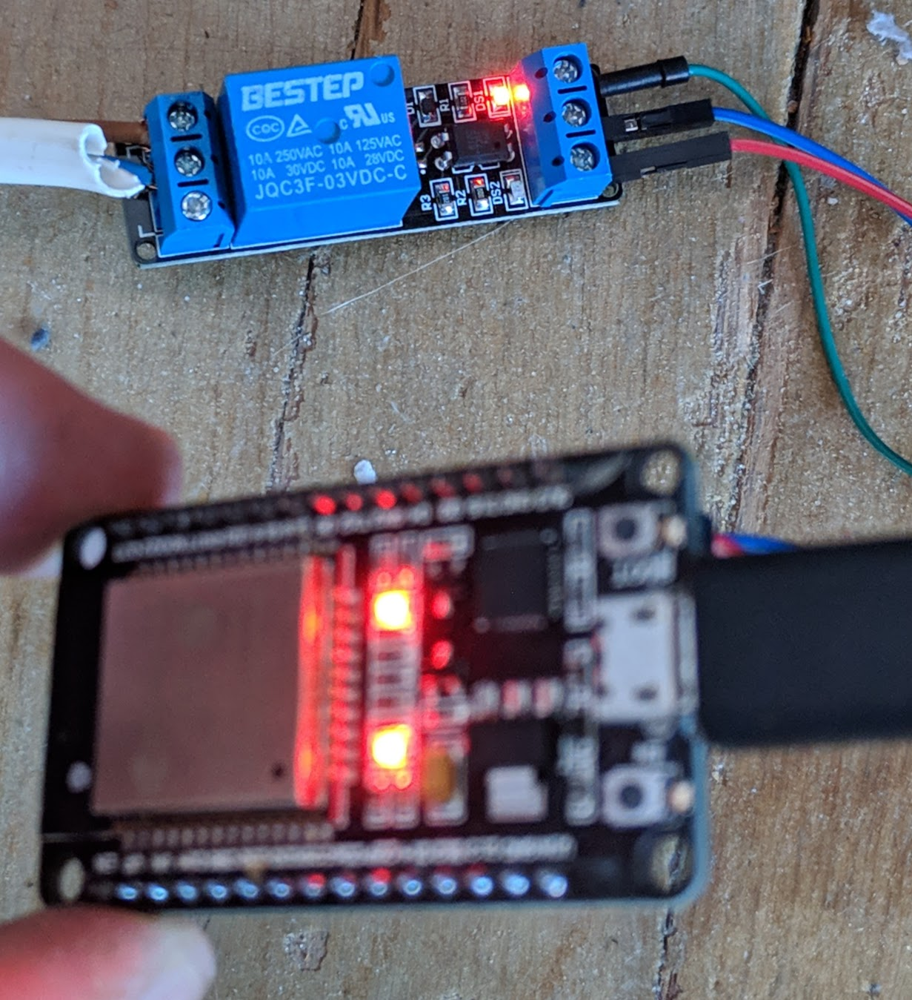

# ESP32 MQTT RELAY

This is a setup of a heat switch controlled via mqtt for the esp32. It's made with the esp-idf framework.

## Requirements

* [esp-idf](https://docs.espressif.com/projects/esp-idf/en/stable/get-started/index.html)
* [mqtt library](https://github.com/espressif/esp-mqtt)

## Hardware

* ESP32
* [3.3v relay](https://es.aliexpress.com/item/3-V-1-canal-rel-placa-de-interfaz-de-m-dulo-de-bajo-nivel-gatillo-optoacoplador/32951573122.html?spm=a2g0s.9042311.0.0.561163c0BdwjRj)




## Build

Make sure you have [setup](https://docs.espressif.com/projects/esp-idf/en/stable/get-started/#setup-toolchain) the esp-idf toolchain correctly and installed the mqtt library to the components/ folder of your esp-idf installation.

```
# Setup wifi and mqtt access
make menuconfig

# Build the project
make

# flash the esp32
make flash
```

## License

[MIT License](./LICENSE)

Copyright (c) Rasmus Schlunsen
